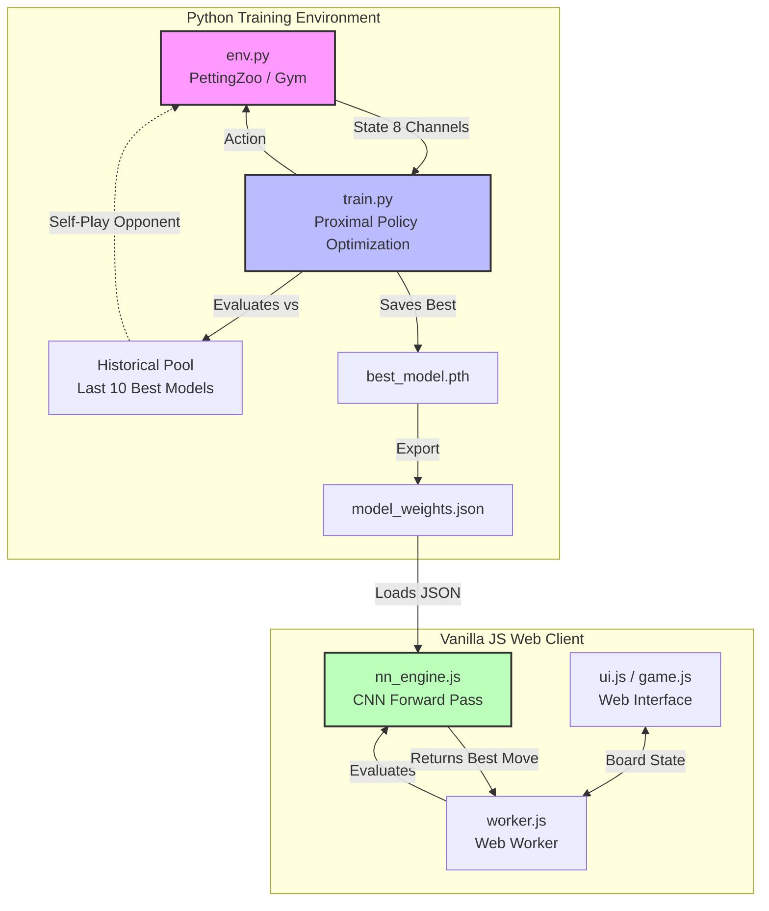

# Antigravity: FlagStrike 7x7 (Reinforcement Learning)

FlagStrike 7x7 es un juego de mesa estratégico de información perfecta. Esta versión implementa una Inteligencia Artificial entrenada desde cero jugando contra sí misma utilizando Aprendizaje por Refuerzo (PPO y Self-Play).

## Reglas del Juego

1. **Tablero**: Cuadrícula de 7x7.
2. **Piezas**: Cada jugador tiene 1 Bandera (inamovible) y 5 Atacantes numerados del 1 al 5.
3. **Movimiento**: Los atacantes mueven 1 casilla en cualquier dirección (incluyendo diagonales).
4. **Combate**: Al moverse a una casilla enemiga:
   - Mayor valor gana.
   - Empate numérico: el Atacante gana.
   - **Regla Especial (El Espía)**: El Atacante '1' derrota al Atacante '5' si es quien inicia el ataque.
   - No se permiten movimientos suicidas (donde el atacante perdería según las reglas matemáticas).
5. **Victoria**: El primer jugador en capturar la bandera enemiga gana, o si el oponente se queda sin atacantes móviles.

---

## Arquitectura de Inteligencia Artificial (MARL)

La IA ya no depende de reglas codificadas a mano (heurísticas o Minimax tradicional). En su lugar, ha aprendido a jugar evaluando patrones visuales en el tablero mediante una **Red Neuronal Convolucional (CNN)**.

### Infografía del Proceso de Entrenamiento

### Conceptos Clave del Entrenamiento:
1. **8 Canales de Visión**: La IA "ve" el tablero en 8 capas separadas (Mi Bandera, Mis Atacantes, Mi '1', Mi '5', etc.), lo que le permite identificar tácticas avanzadas sin necesidad de que el humano le explique qué pieza es peligrosa.
2. **Iron Sharpens Iron (Self-Play)**: La IA aprendió jugando millones de partidas contra sí misma.
3. **Historical Pool**: En lugar de jugar solo contra su última versión (lo que causa un ciclo cíclico de estrategias), entrena contra un "pool" de sus versiones pasadas para asegurar robustez contra cualquier estrategia.
4. **Cero Dependencias en Cliente**: Toda la inferencia matemática (las multiplicaciones de las matrices convolucionales) ocurre en Vanilla JavaScript puro en tu navegador, sin PyTorch ni TensorFlow.js, logrando un peso minúsculo y una integración limpia.
